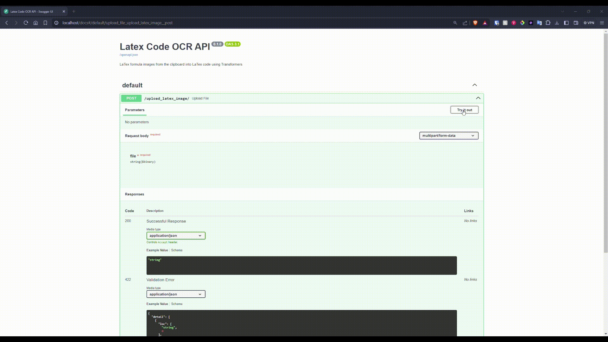

# LaTex Formula OCR API

FastAPI-based API to convert LateX formula images into LaTeX code using a pre-trained Transformer model.

---

## How to Run

### Locally

**Clone the repository**

```console
git clone <>
cd <>
```

**Install dependencies**

```console
pip install -r requirements.txt
```

**Run the API**

```console
fastapi dev main.py
```

### Using Docker

**Build the Docker image**

```console
docker build -t latex-ocr-api .
```

**Run the Docker container**

```console
docker run -d --name nougat-ocr-api-container -p 80:80 latex-ocr-api
```

**Access the API**

Open your web browser and go to `localhost/docs` to access the Swagger UI for the API.

### Download from Docker Hub

**Pull the Docker image**

```console
docker pull <>
```

**Run the Docker container**

```console
docker run -d --name nougat-ocr-api-container -p 80:80 your-dockerhub-username/nougat-ocr-api:latest
```

**Access the API**

Open your web browser and go to `localhost/docs` to access the Swagger UI for the API.

---

## API Endpoints

### Upload LaTex Image

- **URL:** /upload_latex_image/
- **Method:** POST
- **Description:** Upload an image containing LaTeX formula to receive the corresponding LaTeX code.
- **Request:**
    - **'file'**: The image file containing the LaTeX formula.
- **Response:** Plain text containing the LaTeX code.

---

## Demo



---

## Acknowledgements

This API is based on [nougat-latex-base](https://huggingface.co/Norm/nougat-latex-base), a fine-tuning of [facebook/nougat-base](https://huggingface.co/facebook/nougat-base) with [im2latex-100k](https://zenodo.org/records/56198#.V2px0jXT6eA), and made by [NormXU](https://github.com/NormXU).

---

## License

MIT